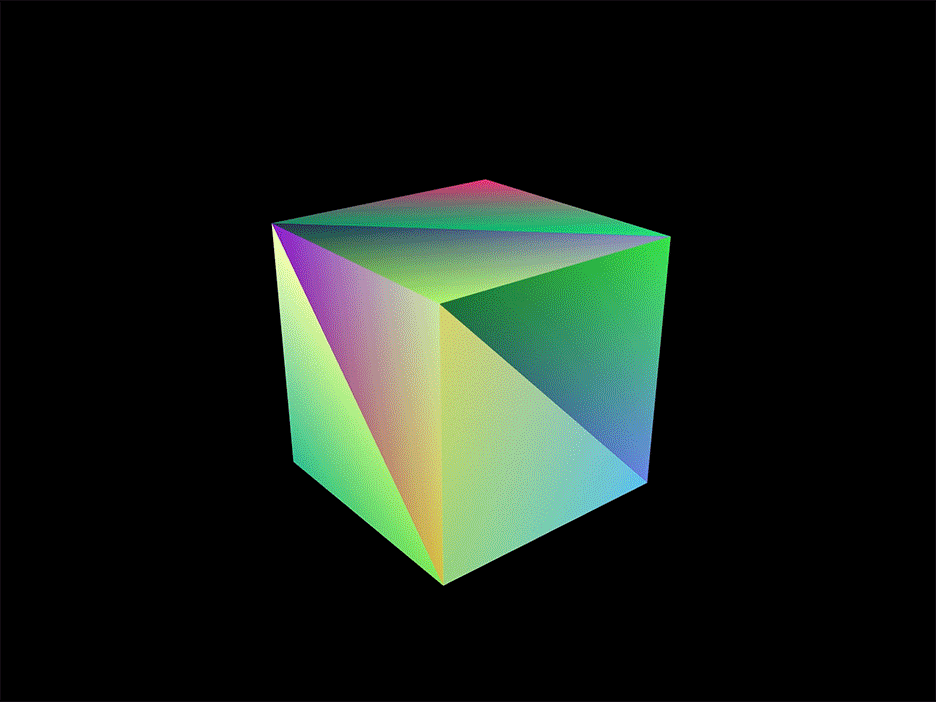
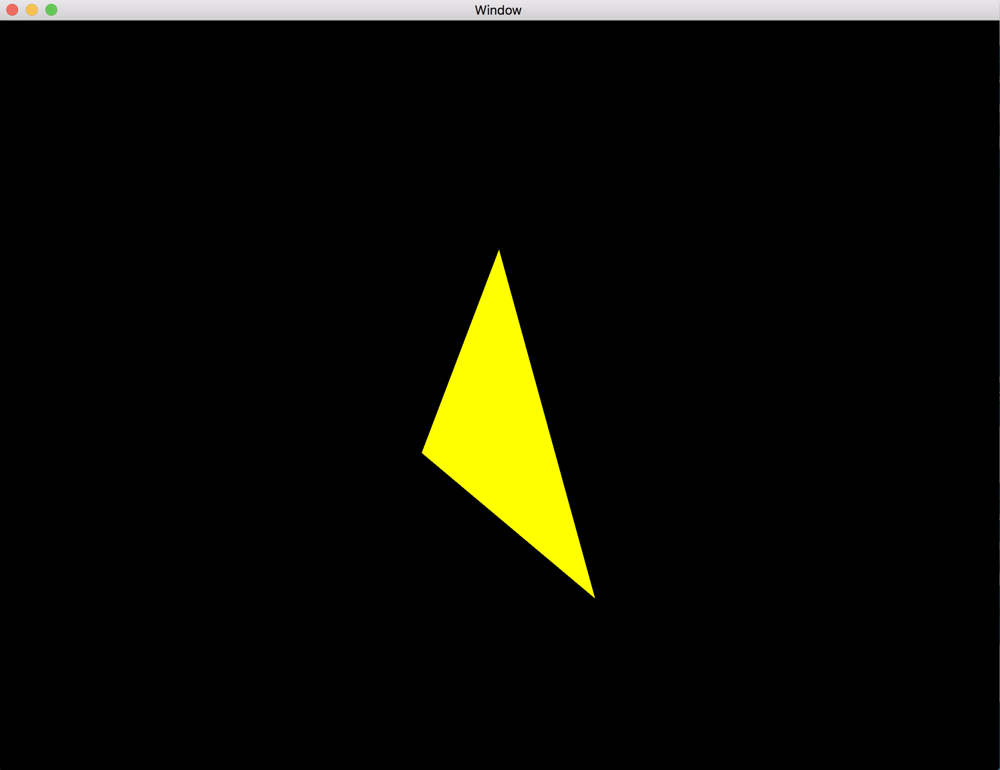
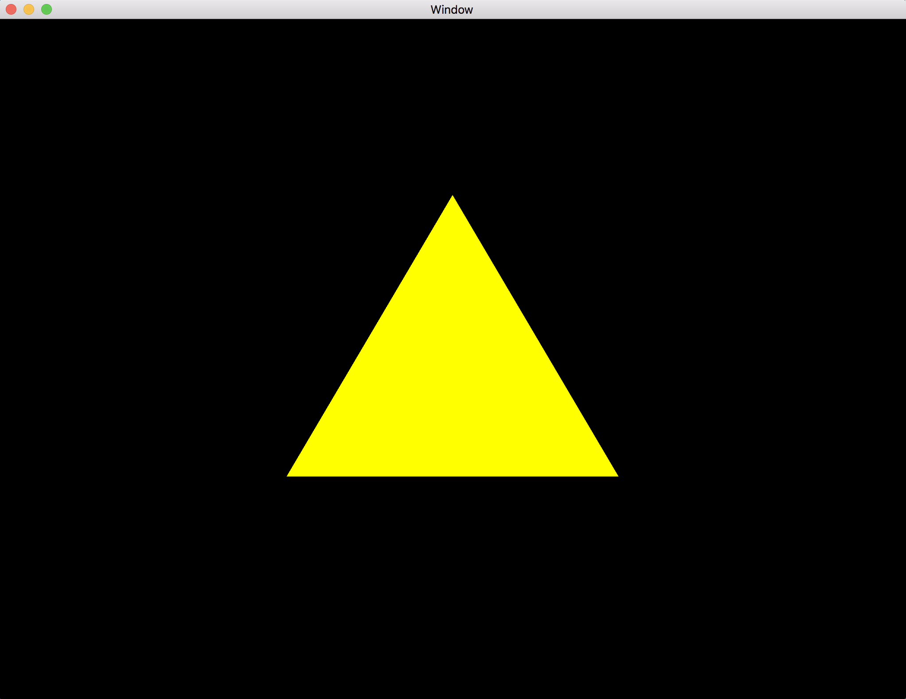
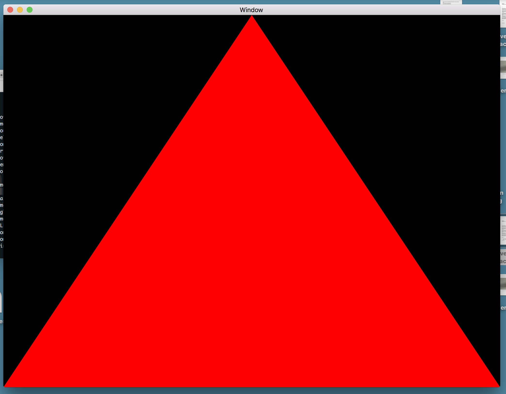

In this file I will document the process. Starting with library/dependency installations and will keep a documentation of the progress. Most recent updates will be at the top. 

**Rendering A cube**

**Model View Projection Matrix for Shader**

Creating the Model view projection matrix to translate the camera/object within the space. Currently the Triangle is located at the origin but the camer is translate away from the origin and looking at the world coordinate system origin.

Currently compiling as : `g++ window.cpp helper.cpp -o window -lglew -lglfw -framework OpenGL`

**GLM for matrice calculations**

*install:*

  * installed with homebrew: 

    * `brew install glm`

**Red Triangle**

Currently compiling as : `g++ window.cpp 02_triangle_shader.cpp shader.cpp -o window -lglew -lglfw -framework OpenGL `

producing red triangle like in the tutorial: 

I might have had certain dependencies/ libraries installed before. I will only list the libraries I had to install personally. 

**GLEW**

What is glew? https://gamedev.stackexchange.com/questions/112182/what-is-glew-and-how-does-it-work

*install:*

  * installed with homebrew: 

    * `brew install glew`

  * also had the same linker problem : symbol(s) not found for architecture x86_64

    * need to link with `-lglew` for gcc. 
    
**GLFW**

it deals with window creation/destroying, user input/output we will use GLFW. Recommended by https://solarianprogrammer.com/2013/05/10/opengl-101-windows-osx-linux-getting-started/ and http://www.opengl-tutorial.org/beginners-tutorials/tutorial-1-opening-a-window/. Reason enough I suppose...

*install:*

  * used homebrew to install:

    * `brew install glfw3` 

  * Error when using _glfwInit:

    * `ld: symbol(s) not found for architecture x86_64`

    * need to link the glfw with `-lglfw`

might need to link certain frameworks as well : https://stackoverflow.com/questions/43817344/trouble-compiling-glfw-undefined-symbols

